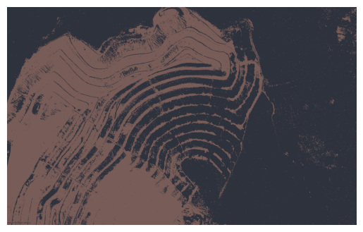

# image-segmentation-vegetation
This repository contains a script to divide a mining area based on its vegetation, with the goal of helping engineers estimate the percentage of sediments that the area will generate.

## Disclaimer
This repository is part of a larger project where I document my path through my [MBA in Data Science and Analytics](https://github.com/marcuszucareli/MBA). Fell free to check!

## Rationale
We all know that mining is an extremely aggressive process for the environment. For this reason, engineers have the mission to reduce the environmental impacts of these activities.

One way to reduce the environmental impacts of mining is to contain the sediments generated in the process, preventing them from reaching rivers and causing siltation.

The calculation of the amount of sediments generated is performed, in a simplified manner, based on the amount of vegetated and non-vegetated area. Vegetated areas generate fewer sediments than non-vegetated ones.

The thing is, these areas are manually divided by engineers, tracing polygons and summing up the areas in a rather non-automated way. This work proposes a division carried out by means of a k-means clustering algorithm, to obtain the percentages of vegetated area and exposed soil.

## Study Goals
- Implement my first k-means cluster using python to apply what was studied in my cluster class.
- Start to work with scikit-learn, a fundamental tool
- Practice secondary tools that are also useful in a data science role, like Git and markup languages.

## Script Goals
- Output the percentage of vegetaded and non-vegetaded area of an image using k-means algorithm

## Non-Goals
- This is a simple implementation of a cluster algorithm, and I have no intention of transforming it into a machine learning algorithm at this time.

- This solution will only contemplate the image from this specific mine, where the soil and vegetated areas are clear.

- There are already solutions to make image segmentation, but remember that the main goal of this repository is to study.

## Overview of Jupyter Notebook
The proccess to calculate the vegetated and non-vegetated area runs as follows:
1. Preparing the data
    - Read the image
    - reshape the image to a 1D array with the RGB info

2. Cluster the data
    - Create a cluster using k-means with 2 clusters (vegetated and non-vegetated area)

3. Reshape the image
    - Recreate the image using the colors of the centroids of the clusters

4. Calculate the percentage of vegetated and non-vegetated area
    - Get the labels results of the cluster and use pandas to calculate the percentage that each cluster represents in the image.

The notebook can be found in this repository in the "mine-image-segmentation.ipynb" file.

## Image comparison
Below, a comparison between the original image and the cluster to delineate vegetated and non-vegetated areas. The estimate appears to meet the needs for an initial study of sediment generation.

  
  

